# Navigation of Modularization with Dependency Injection

#### Preparation

Please make sure you understand what is dependency injection.

[Dagger2](https://dagger.dev/)

[Hilt](https://developer.android.com/training/dependency-injection/hilt-android)

If you have experience in dependency of injection, you will easier to understand the idea.

[Github - ViewModel with Dagger Injection](https://github.com/alexfacciorusso/DaggerViewModel)

### Background

Modularization is a very hot topics now a days.

However, navigation implementation in modularization is still under discussion.

There are lots of ways to solve the problem and this is 1 of the solution that I figure out.

### Problems

1. After modularized the project, each module doesn't know each other. We cannot transit from 1 screen to another screen.
2. You can include 1 feature in another feature to solve problem #1.

   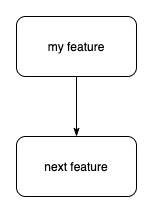
3. If you do #2, it cause cyclic dependency if Screen A can go to Screen B and Screen B can go to Screen A.

   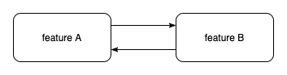
4. With Android Navigation Component, when we move the activity / fragment, it has impact to all nav_graph.xml files that we defined.

### Idea

1. Navigation should be extracted and independent from the feature.

With going back to the original implementation for startActivity, the requirement is very simple

```
class MyActivity: Activity() {
    fun goToNextPage() {
        val intent = Intent(context, NextActivity::class.java) // This is the problem, we need to know NextActivity
        startActivity(intent)
    }

    fun showNextFragment() {
        supportFragmentManager.beginTransaction()
                .replace(R.id.fragment_container, NextFragment()) // This is the problem, we need to know NextFragment
                .commitAllowingStateLoss()
    }
}
```

If we can abstract the call of `Intent(context, NextActivity::class.java)` and `NextFragment()`, then we can solve the problem

In order to solve this problem, we need an interface to do it.

```
interface Navigator{
    fun newIntent(context: Context): Intent
    fun createFragment(): Fragment
}
```

Then the implementation of Activity will be changed to

```
class MyActivity: Activity() {
    fun goToNextPage(navigator: Navigator) {
        val intent = navigator.newIntent(context) // We don't need to know NextActivity anymore
        startActivity(intent)
    }

    fun showNextFragment() {
        supportFragmentManager.beginTransaction()
                .replace(R.id.fragment_container, navigator.createFragment()) // We don't need to know NextFragment anymore
                .commitAllowingStateLoss()
    }
}
```

If we put the interface into separated module, let's say navigation module, then each feature won't dependency on each other anymore

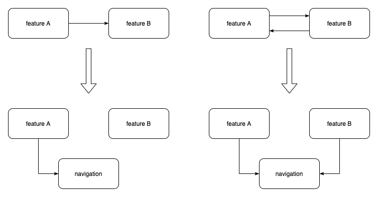

2. With 1st idea, we need to solve other problems
   1. How does the UI / ViewModel get the Navigator?
   2. Where is the interface implementation?

In here, we will use the idea which is coming from the DaggerViewModel

With Dagger/Hilt, we can use following keywords, `@Binds` `@IntoMap`. This is also the core idea of DaggerViewModel

First, we need to create a new annotation key for navigator

```
@Target(
    AnnotationTarget.FUNCTION,
    AnnotationTarget.PROPERTY_GETTER,
    AnnotationTarget.PROPERTY_SETTER
)
@MapKey
annotation class NavigatorKey(val value: KClass<out Navigator>)
```

Then we need a Factory interface which is similar to ViewModel.Factory

```
interface NavigatorFactory {
    @Nullable
    @MainThread
    fun <T : Navigator?> get(modelClass: Class<T>): T?
}
```

Now, we need to implement the dagger factory, which is using the exactly same idea from DaggerViewModelFactory

```
open class DaggerNavigatorFactory @Inject constructor(
    private val navigatorMap: Map<Class<out Navigator>, @JvmSuppressWildcards Provider<Navigator>>
) : NavigatorFactory {
    companion object {
        private const val TAG = "NavigatorFactory"
    }

    @Suppress("UNCHECKED_CAST")
    override fun <T : Navigator?> get(modelClass: Class<T>): T? {
        val navigator = navigatorMap[modelClass] ?: navigatorMap.asIterable().firstOrNull {
            modelClass.isAssignableFrom(it.key)
        }?.value
        if (navigator == null) {
            Log.w(TAG, "$modelClass is not yet provided")
        }
        return try {
            navigator?.get() as T?
        } catch (e: Exception) {
            throw e
        }
    }
}
```

Finally, we need to create a depenedency module to provide the dagger factory
```
@Module
@InstallIn(SingletonComponent::class) // With Hilt, we can simply put it in application scope, since navigation should always exists
interface NavigatorFactoryModule {
    @Binds
    fun bindNavigatorFactory(navigatorFactory: DaggerNavigatorFactory): NavigatorFactory
}
```

From here, now we can inject the NavigatorFactory to any place of the app. e.g. in Activity class

```
@AndroidEntryPoint
class MyActivity : Activity {
    @Inject
    lateinit var navigatorFactory: NavigatorFactory
}
```

Till here, we solved the 1st problem, then we need to fix the implementation of the Navigator

We already have the interface

```
interface Navigator{
    fun newIntent(context: Context): Intent
    fun createFragment(): Fragment
}
```

However, it is not good to only have 1 interface since each feature could have different requirements.

Thus we add 1 more interface layout

```
interface Navigator

interface FeatureANavigator : Navigator {
    fun newIntnet(context: Context): Intent // From the interface we know Feature A only provide accessing for Activity
}

interface FeatureBNavigator : Navigator {
    fun createFragment(): Fragment // From the interface we know Feature B only provide accessing for Fragment
}
```

Then we need to implement the interface.

Since the only way to know the actual Activity / Fragment be provided, is coming from the feature module it self.

So the implementation of the Navigator is also inside the feature module

```
:feature-a
class FeatureANavigatorImpl : FeatureANavigator{
    override fun createIntent(context: Context): Intent {
        return Intent(context, FeatureAActivity::class.java) // There is no problem, since the module feature-a owns the Activity
    }
}
```

But we still need to put this implementation to the NavigatorFactory, otherwise other modules won't able to access it.

To achive it, we use the similar idea from DaggerViewModel, using `@Binds @IntoMap`

```
:feature-a
class FeatureANavigatorImpl @Inject constructor() : FeatureANavigator{   // @Inject constructor is required to genreate the Provider by Dagger
    override fun createIntent(context: Context): Intent {
        return Intent(context, FeatureAActivity::class.java)
    }
}

@Module
@InstallIn(SingletonComponent::class)
abstract class FeatureANavigatorModule {
    @Binds
    @IntoMap
    @NavigatorKey(FeatureANavigator::class.java)  // We defined NavigatorKey with Class<Navigator> before
    abstract fun bindFeatureANavigator(navigator: FeatureANavigatorImpl): Navigator  // We map FeatureANavigator::class.java to FeatureANavigatorImpl
}
```

With this implementation, we also solve 2nd problem.

### Example

Assume we have 1 project, the overview looks like this

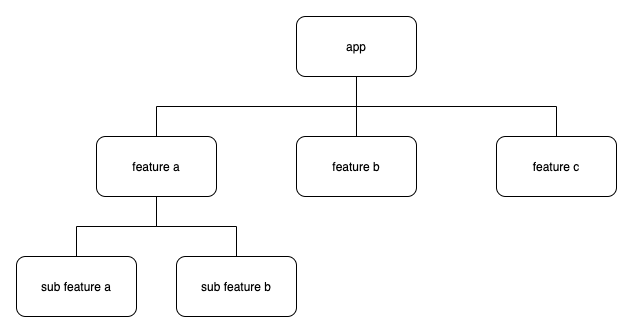

1. app module has 3 features a, b, c
2. feature a has sub features, a, b

For each feature, the outflow looks like following

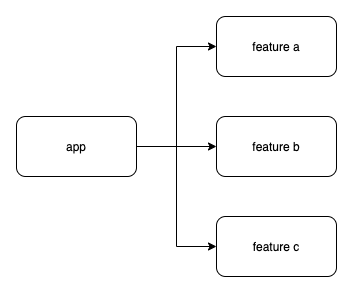

1. app can go to feature a
2. app can go to feature b
3. app can go to feature c

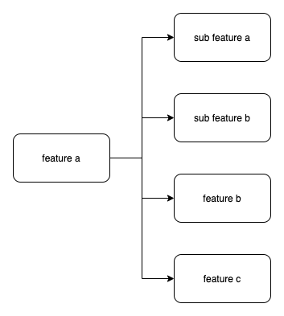

1. feature a can go to sub feature a
2. feature a can go to sub feature b
3. feature a can go to feature b
4. feature a can go to feature c

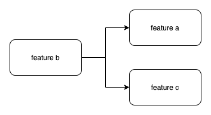

1. feature b can go to feature a
2. feature b can go to feature c

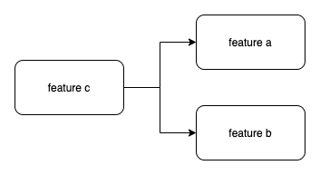

1. feature c can go to feature a
2. feature c can go to feature b

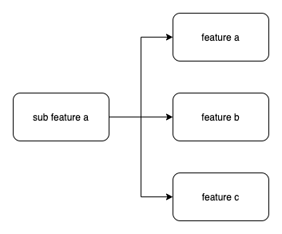

1. sub feature a can go to feature a
2. sub feature a can go to feature b
3. sub feature a can go to feature c

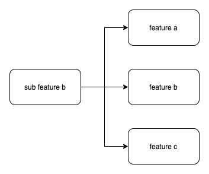

1. sub feature b can go to feature a
2. sub feature b can go to feature b
3. sub feature b can go to feature c

if you draw the flow with direction, including all modules, the graph looks like

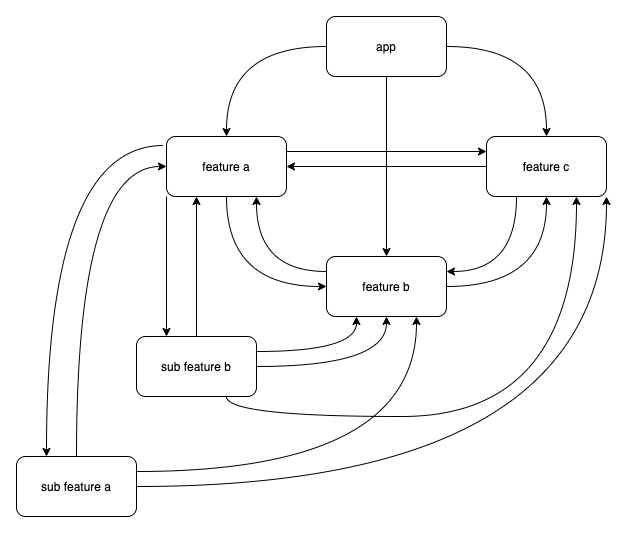

It is nightmare if you use Android Navigation Component, in worst case, you will have (N-1)N / 2 * 2, which N is number of screen, * 2 means each screen can transit to each other.

Imagine you want to refactor 1 module, how many navigation graph xml file you need to change.

With the solution, everyone only dependency on the XXXNavigator interface, as soon the interface doesn't change, there will be no impact to other modules.

The worst case of navigation is N, where N is number of screen.

#### Extra benefit

1. Refactoring is very common for each project.

You can simply route the screen from old implementation to new one.

2. Dynamic module attachment

Sometimes we want to create new feature, before the new feature is done, you can create the interface for the navigation. Then you won't be blocked by other development.

In the example project, you can try to comment out any feature in build.gradle of app module.

When the feature is removed from the app, compilation still works without any problem

### Known Issue

1. Due the dagger limitation, if you implemented the DaggerNavigatorFactory, without any module to bind the navigator, it will cause compilation error.
2. It won't work with Dynamic Feature since the graph is built during compile time.

### References

[What is module?](https://developer.android.com/studio/projects)

[Google IO 2018 - App Bundle](https://www.youtube.com/watch?v=bViNOUeFuiQ)

[Google IO 2019 - Modularization](https://www.youtube.com/watch?v=PZBg5DIzNww)

[Android Navigation Component](https://developer.android.com/guide/navigation/navigation-getting-started)
